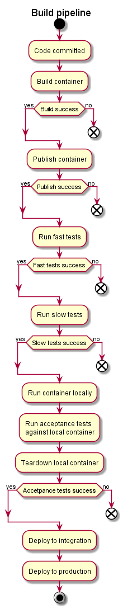

# usher

### WARNING: still in active development

#### Description

A command line app to usher our containers to production

Essentially it allows orchestration of lots of different command line applications into a single configuration file.

#### To do

- [x] Describe the build pipeline - [see diagram](#our-standard-build-pipeline)
- [x] Flow chart of how Usher works - [see diagram](#run)
- [ ] Publish the Usher NPM module to registry
- [ ] Single command
- [ ] Sequence of commands
- [ ] Retry commands
- [ ] Passing exit codes
- [ ] Team-city configuration
- [ ] Publish docker image to internal registry
- [ ] Usher to publish Usher
- [ ] Plugin for docker commands
- [ ] Plugin for consul commands
- [ ] Migrate Titan to use Usher

#### Motivations

- I don't like deployment configuration living in continuous integration software
- I believe it should be possible to run the same deployment code from any machine in case the CI goes down
- It makes it easier to test deployments

#### Usher flow chart

#### Our standard build pipeline

